

      
    
CURSO DE ESPECIALIZACIÓN EN IA Y BIG DATA

       
    <h1 style="color: blue; font-size: 3em;">Trabajo de Investigación: Matriz de Confusión</h1>
     
    <h2 style="font-weight: normal;">Predicción de Accidentes Cerebrovasculares mediante Scikit-learn</h2>
         
    

        
<strong>Autor:</strong> Pablo Palacio Cobo

        
<strong>Fecha:</strong> 12 de mayo de 2026

    

       

<!-- INDICE -->
<h1>ÍNDICE:</h1>
<!-- Ctrl + Shift + V -->

<h2><a href="#introduccion">1. Introducción</a></h2>
<ul>
    <li>Contexto del problema</li>
    <li>Objetivos del trabajo</li>
</ul>

<h2><a href="#descripcion">2. Descripción del dataset</a></h2>
<ul>
    <li>Origen y características</li>
    <li>Distribución de clases</li>
</ul>

<h2><a href="#preparacion">3. Preparación de los datos</a></h2>
<ul>
    <li>Limpieza y transformaciones</li>
    <li>Justificación de decisiones (evitar data leakage)</li>
</ul>

<h2><a href="#modelos">4. Modelos de clasificación</a></h2>
<ul>
    <li>Modelos implementados</li>
    <li>Justificación de su elección</li>
</ul>

<h2><a href="#metricas">5. Matriz de confusión y métricas</a></h2>
<ul>
    <li>Matrices obtenidas por modelo</li>
    <li>Análisis de falsos positivos y falsos negativos</li>
</ul>

<h2><a href="#evaluacion">6. Evaluación y comparación de resultados</a></h2>
<ul>
    <li>Comparación entre modelos</li>
    <li>Discusión alineada con el tema elegido</li>
</ul>

<h2><a href="#conclusiones">7. Conclusiones y limitaciones</a></h2>

<h2><a href="#mejoras">8. Líneas de mejora y trabajo futuro</a></h2>

<h2><a href="#referencias">9. Referencias</a></h2>

<h2><a href="#anexo">10. Anexo A – Uso de herramientas de Inteligencia Artificial</a></h2>
<ul>
    <li>Herramienta(s) utilizada(s):</li>
    <li>Finalidad del uso:</li>
    <li>Descripción del uso:</li>
    <li>Prompts empleados:</li>
</ul>

<!-- Salto de pagina -->

<!-- 1. Introducción -->
<h1 id="introduccion">Introducción</a></h1>

El accidente cerebrovascular (ACV) representa una de las emergencias médicas más críticas en la actualidad. Según la Organización Mundial de la Salud (OMS), es la segunda causa de muerte a nivel global, responsable de aproximadamente el 11% del total de defunciones. Debido a que la intervención temprana es el factor determinante para reducir la mortalidad y las secuelas permanentes, la identificación de pacientes de alto riesgo mediante variables clínicas (como la hipertensión, el índice de masa corporal y la edad) es una prioridad en salud pública.

Desde una perspectiva técnica, este problema presenta un desafío común en el análisis de datos médicos: el desbalance de clases. En la mayoría de los registros de salud, el número de personas que sufren un ictus es significativamente menor que el de personas sanas. Esto genera un sesgo en los modelos de Machine Learning que, si no se analiza mediante una matriz de confusión, podrían arrojar una falsa sensación de precisión (Accuracy) mientras ignoran por completo a los pacientes en riesgo.

Este trabajo se estructura bajo los siguientes objetivos técnicos:
<ul>
    <li><b>Implementación de modelos predictivos:</b> Desarrollar y comparar al menos dos algoritmos de clasificación (Regresión Logística y Random Forest) utilizando la librería Scikit-learn para predecir el riesgo de ictus.</li>
    <li><b>Análisis crítico de la Matriz de Confusión:</b> Evaluar el rendimiento de los modelos más allá de la precisión global, centrándose en la identificación de Falsos Negativos, dada su gravedad en el contexto médico.</li>
    <li><b>Tratamiento del desbalance de datos:</b> Aplicar y justificar técnicas de balanceo de pesos (class_weight='balanced') para corregir el sesgo hacia la clase mayoritaria y mejorar la capacidad de detección del modelo.</li>
    <li><b>Validación de métricas:</b> Determinar qué métricas (Precision, Recall o F1-Score) son las más adecuadas para este problema específico, fundamentando la decisión en los resultados obtenidos en las matrices de cada modelo.</li>
</ul>

<!-- 2. Descripción del dataset -->
<h1 id="descripcion">Descripción del dataset</a></h1>

El dataset que he decidido para usar en este trabajo trata sobre un conjuntos de datos que se utiliza para predecir si es probable que un paciente tenga un accidente cerebrovascular en función de los parámetros de entrada como el género, la edad, varias enfermedades y el estado de tabaquismo. Cada fila en los datos proporciona información relevante sobre el paciente. Ademas el origen del dataset es confidencial y con uso educativo unicamente, a excepcion de uso para investigacion pero acreditando al autor. El dataset se puede descargar desde este enlace: 
<a href="https://www.kaggle.com/datasets/fedesoriano/stroke-prediction-dataset" target="_blank">Stroke Prediction Dataset disponible en Kaggle.</a>

Las columnas de las que disponemos son:
<ul>
    <li><b>id:</b> identificador único.</li>
    <li><b>gender:</b> género del paciente.</li>
    <li><b>age:</b> edad del paciente.</li>
    <li><b>hypertension:</b> 0 si el paciente no tiene hipertensión, 1 si el paciente tiene hipertensión.</li>
    <li><b>heart_disease:</b> 0 si el paciente no tiene ninguna enfermedad cardíaca, 1 si el paciente tiene una enfermedad cardíaca.</li>
    <li><b>ever_casado:</b> si o no.</li>
    <li><b>work_type:</b> tipo de trabajo.</li>
    <li><b>residence_type:</b> tipo de residencia.</li>
    <li><b>avg_glucose_nivel:</b> nivel promedio de glucosa en sangre.</li>
    <li><b>bmi:</b> índice de masa corporal.</li>
    <li><b>smoking_status:</b> estado de fumador.</li>
    <li><b>stroke:</b> 1 si el paciente tuvo un accidente cerebrovascular o 0 si no.</li>
</ul>

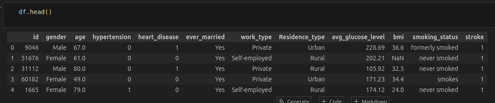
  

Con el metodo .shape podemos averiguar de una forma muy sencilla el numero total de columnas y filas de las que disponemos en el dataset (5110 filas y 12 columnas):

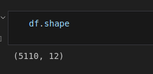
  

Otra parte fundamental que tenemos que conocer de los datos es su tipo, si son de tipo string, int, float, etc. Además el metodo .info() nos demuestra un detalle muy importante para la calidad del dataset, el numero de nulos que tiene cada columna, en este dataset tenemos algunos datos nulos. En el apartado de limpieza de datos veremos como podemos solucionar dicho problema

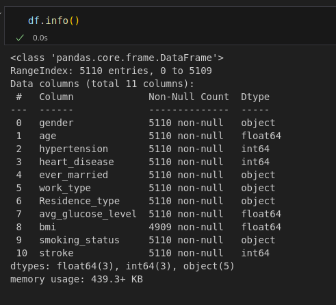
  

Tras analizar y explorar el dataset, he podido comprobar que se trata de un dataset con dos clases stroke (0/1) bastante desbalanceado, esto puede causar problemas al modelo a la hora de entrenarlo ya que dispone de muy pocos casos de pacientes que han sufrido un accidente cerebrovascular. En total hay 5110 registros de los cuales hay:
<ul>
    <li><b>Stork 0:</b> 4861.</li>
    <li><b>Stork 1:</b> 249.</li>
</ul>

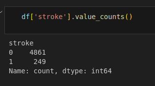

<!-- <h4>¿Como solucionamos el desbalanceo de clases?</h4>

Por defecto, los modelos de Scikit-learn asumen que todas las filas del dataset tienen la misma importancia (peso = 1). Si tienes 940 sanos y 42 enfermos, el modelo se "esfuerza" 940 veces más en aprender a identificar sanos que en identificar enfermos.  

Al usar class_weight='balanced', Scikit-learn aplica una fórmula matemática para ajustar automáticamente los pesos de las clases de forma inversamente proporcional a su frecuencia.
 -->

<!-- 3. Preparación de los datos -->
<h1 id="preparacion">Preparación de los datos</a></h1>

Una vez que ya tenemos una primera vista del dataset, numero de columnas y filas, significado de cada columna y sus posibles valores. Ahora lo mas importante que tenemos que hacer es la limpieza de los datos, sin este procedimiento, cualquier analisis posterior como el de la matriz de confución seria erróneo. Debemos observar detalles como el numero de valores nulos que he comentado antes, y como hemos podido ver en la anterior captura, tenemos algunos valores nulos.

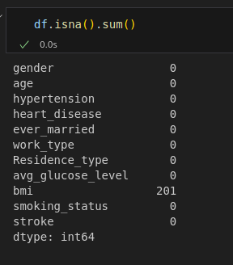

En total hay 201 valores nulos, todos situados en la columna "bmi" (indice de masa corporal), al ser un numero muy reducido ante mas de 5000 registros he decidido eliminar esos registros ya que en principio no deberia resultarnos ningun problema teniendo en cuenta que solo representan menos de un 4% del total de datos. Con lo cual nos deja con la siguiente proporcion de clases: 
<ul>
    <li><b>Stork 0:</b> 4700.</li>
    <li><b>Stork 1:</b> 209.</li>
</ul>

Otra forma de limpiar los datos es mediante la eleccion de las variables que vamos a usar para entrenar el modelo. Para ello, podemos analizar la correlación entre cada variable predictora y la variable objetivo (etiqueta), lo que nos ayuda a identificar cuáles aportan información relevante para la predicción y cuáles pueden descartarse. En principio solo voy a borrar la columna de id que no aporta absolutamente nada.

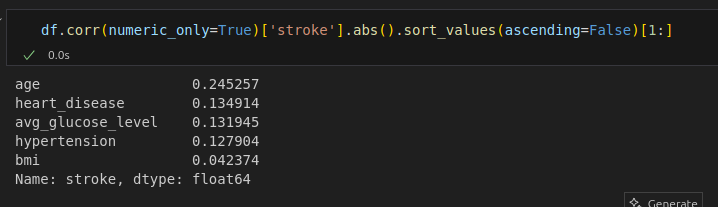

Como hemos podido observar en la captura de los tipos de columnas que tenemos, vemos que teneos columnas categoricas. Mediante el metodo get_dummies(), pasamos las columnas a numericas, añadiendo nuevas columnas numericas con cada valor unico de cada columnas categorica, de esta forma podremos usar estos datos convertidos a numericos para entreanr nuestro modelo. Pasamos de tener inicialmente 11 columnas a tener 22. Con esto tambien podemos ver la correlacion de cada valor numerico unico de cada nueva columna

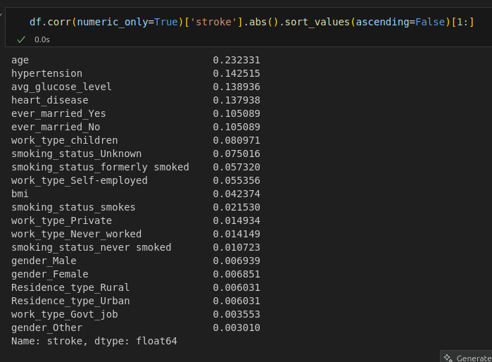

Para finalizar con este apartado, tenemos que definir X (todas las variables menos la etiqueta) e y (etiqueta). Muy importante escalar los datos mediante StandardScaler() antes de entrenar nuestros modelos y dividir en entrenamiento y test.

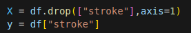
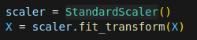
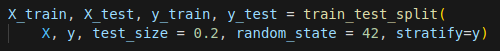

<!-- 4. Modelos de clasificación -->
<h1 id="modelos">Modelos de clasificación</a></h1>

El primer modelo de clasficacion que voy a usar es RandomForestClassifier ya que es el mas robusto frente a regresion lineal, svm, regresion logistica, etc por las siguientes razones:
<ul>
    <li>Captura interacciones no lineales entre variables, algo que ni regresión logística ni lineal pueden hacer.</li>
    <li>No le afecta que las variables estén en escalas distintas, el modelo no necesita que estén en el mismo rango porque solo compara valores dentro de cada variable, no entre ellas. Regresión logística y SVM sí necesitan normalización previa.</li>
    <li>Es estable aunque haya valores extremos, si un paciente tiene un nivel de glucosa muy inusual, ese dato no arrastra al modelo completo. Al trabajar con umbrales ("¿es mayor o menor que X?") en lugar de con el valor numérico exacto, los casos atípicos tienen un impacto muy limitado.</li>
    <li>Indica qué variables son más importantes, al terminar el entrenamiento ya tienes un ranking de qué factores (edad, glucosa, bmi...) contribuyen más a predecir el accidente cerebrovascular, lo que en un contexto médico tiene valor más allá de la predicción en sí.</li>
</ul>

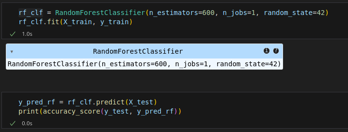

El segundo modelo de clasficacion que voy a usar es LogisticRegression por las siguientes razones:
<ul>
    <li>Da una probabilidad, no solo una clase: en lugar de decir únicamente "tendrá ictus", devuelve un número como 0.82 o 0.23. Eso permite ajustar a partir de qué probabilidad actuar, algo muy útil en medicina donde detectar todos los enfermos importa más que evitar falsas alarmas.</li>
    <li>El cálculo es una suma sencilla: multiplica cada variable por un peso y las suma. Si un paciente tiene edad alta, glucosa elevada e hipertensión, cada factor añade su parte al resultado final. Puedes ver exactamente qué está sumando cada variable para ese paciente concreto.</li>
</ul>

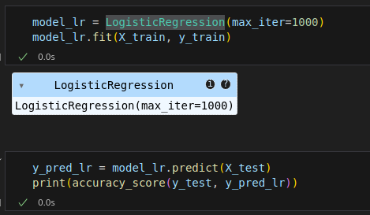

No he usado modelos como SVM ya que son sensibles al desbalance de clases o regresion lineal ya que no es un modelo de clasificacion si no de regresion.

<!-- 5. Matriz de confusión y métricas -->
<h1 id="metricas">Matriz de confusión y métricas</a></h1>

<!-- <h3>LogisticRegression sin class_weight:</h3>

En esta matriz de confusion podemos ver que el modelo ha clasificado correctamente 940 pacientes sanos como sanos, 42 pacientes con un ataque cerebrovascualar como sanos y 0 pacientes como enfermos en ningun caso. Hay un serio problema, el modelo no detecta correctamente, aunque el modelo muestre un 95% de accuracy, no significa que sea bueno ya que predice siempre sano.
 -->

  

    <h3>LogisticRegression sin class_weight:</h3>
    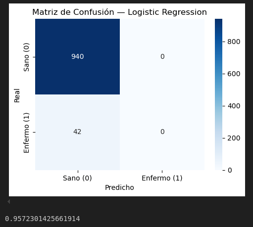
    

      Sin el uso de <code>class_weight="balanced".</code>En esta matriz de confusión podemos ver que el modelo ha clasificado correctamente 940 pacientes sanos como sanos, 42 pacientes con un ataque cerebrovascular como sanos y 0 pacientes como enfermos en ningún caso. Hay un serio problema: el modelo no detecta correctamente los casos positivos. Aunque muestre un 95% de accuracy, esto no significa que sea un buen modelo, ya que predice siempre la clase “sano”.
    

  

  

    <h3>LogisticRegression con class_weight:</h3>
    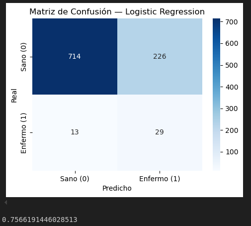
    

      Con el uso de <code>class_weight="balanced".</code>El modelo da más importancia a la clase minoritaria, mejorando la detección de pacientes enfermos y evitando que el modelo favorezca únicamente la clase mayoritaria. Detecta 714 pacientes sanos como sanos, 226 sanos como enfermos (falsos positivos), 29 enfermos como enfermos, y 13 enfermos como sanos (falsos negativos).
    

  

El accuracy bajo a un 75% al usar <code>class_weight="balanced"</code>, aun asi este modelo si esta detectando casos reales. El modelo anterior no sirve para nada, en cambio este modelo si ya que detecta el 69% de los ataques cerebrovasculares (29 de 42). Aunque tambien tiene fallos como los 226 pacientes sanos que el modelo dice que estan enfermos, generando pruebas adiciones inecesarias, pero sigue siendo preferible a no detectar que un paciente esta enfermmo realmente.

<!-- StratifiedKFold -->

<!-- 6. Matriz de confusión y métricas -->
<h1 id="evaluacion">Evaluación y comparación de resultados</a></h1>

<!-- 
Comparando ambos modelos Logistic Regression y Random Forest, ambos no son capaces de reconocer enfermos reales ya que el desbalance de clases hace qeu ambos modelos aprendan a predecir siempre la clase mayoritaria, es decir, predicen que siempre saldra sano. Aunque el accuracy sea de mas del 90%, no nos sirve de anda porque siempre va a decir sano cuando en realidad el modelo no tiene ni idea del resultado real. Para evitar este problema podemos usar <code>class_weight="balanced"</code> para balancear las dos clases, con Logistic Regression, el resultado mejora considerablemente, siendo capaz de detectar enfermos reales, en cambio Random Forest no cambia en absoluto, por el umbral de decision que hace que si cada prediccion. Este parametro <code>class_weight="balanced"</code> calcula automáticamente pesos inversamente proporcionales a la frecuencia de cada clase.
 -->

Comparando ambos modelos, Logistic Regression y Random Forest, se observa que inicialmente ninguno es capaz de identificar correctamente a los enfermos reales debido al fuerte desbalance de clases. Esto provoca que los modelos tiendan a aprender a predecir siempre la clase mayoritaria (sano). Por esta razón, aunque el accuracy supere el 90%, esta métrica resulta engañosa, ya que el modelo no está capturando la clase minoritaria.

Para mitigar este problema se utiliza <code>class_weight="balanced"</code>, que asigna mayor peso a la clase minoritaria durante el entrenamiento. Este parámetro calcula automáticamente pesos inversamente proporcionales a la frecuencia de cada clase, obligando al modelo a penalizar más los errores en los casos de enfermedad.

En el caso de Logistic Regression, este ajuste funciona especialmente bien porque este modelo optimiza una función de pérdida global (log-loss). Al modificar los pesos de las clases, se altera directamente dicha función de optimización, haciendo que el modelo ajuste la frontera de decisión de forma global para dar más importancia a la clase minoritaria. Como resultado, la regresión logística es más sensible al desbalance y mejora notablemente su capacidad de detectar enfermos reales.

En cambio, en Random Forest el efecto es más limitado, ya que el modelo se basa en múltiples árboles de decisión que realizan particiones locales de los datos. Aunque <code>class_weight="balanced"</code> afecta a la construcción de los árboles, no modifica de forma global el criterio final de decisión ni el umbral de clasificación.

El problema principal es que ambos modelos utilizan por defecto un umbral de 0.5 para convertir probabilidades en clases. En datasets desbalanceados, las probabilidades de la clase minoritaria suelen ser bajas (inferiores a 0.5), lo que provoca que el modelo siga clasificando la mayoría de los casos como “sano”, incluso si existe cierta probabilidad de enfermedad. Esto explica por qué la matriz de confusión apenas cambia en Random Forest.

Como alternativa al accuracy, se han utilizado otras métricas más adecuadas para problemas con desbalance de clases, ya que el accuracy puede dar una falsa sensación de buen rendimiento al estar dominado por la clase mayoritaria.

En concreto, se han calculado el <strong>F1-score</strong>, la <strong>precision</strong>, el <strong>recall</strong> y el <strong>ROC-AUC</strong>, que permiten una evaluación más completa del modelo.

El <strong>F1-score</strong> es la media armónica entre precision y recall, y resulta especialmente útil cuando se busca un equilibrio entre ambas métricas en problemas desbalanceados.

La <strong>precision</strong> mide de todos los casos predichos como positivos (enfermos), cuántos son realmente correctos. Es útil cuando se quiere minimizar los falsos positivos.

El <strong>recall</strong> mide de todos los casos positivos reales, cuántos ha sido capaz de detectar el modelo. Es especialmente importante en este problema, ya que permite evaluar si el modelo es capaz de identificar a los enfermos reales, reduciendo los falsos negativos.

Por último, el <strong>ROC-AUC</strong> mide la capacidad del modelo para distinguir entre clases positivas y negativas independientemente del umbral de decisión. Cuanto mayor es este valor, mejor es la capacidad del modelo para separar ambas clases.

<!-- 10. Anexo A – Uso de herramientas de Inteligencia Artificial  -->
<h1 id="anexo">Uso de herramientas de Inteligencia Artificial</a></h1>
<ul>
    <li>Herramienta(s) utilizada(s): Claude</li>
    <li>Finalidad del uso: entender el uso de StratifiedKFold</li>
    <li>Descripción del uso: usar dicho concepto para el desbalance de clases</li>
    <li>Prompts empleados: explica y dame un ejemplo de uso de StratifiedKFold de scikit-learn</li>
</ul>
<ul>
    <li>Herramienta(s) utilizada(s): Claude</li>
    <li>Finalidad del uso: entender mas en profundidad la matriz de confusion</li>
    <li>Descripción del uso: realizar las distintas comparaciones entre las matrices de cada modelo</li>
    <li>Prompts empleados: explicame el funcionamiento de una matriz de ocnfusion</li>
</ul>
